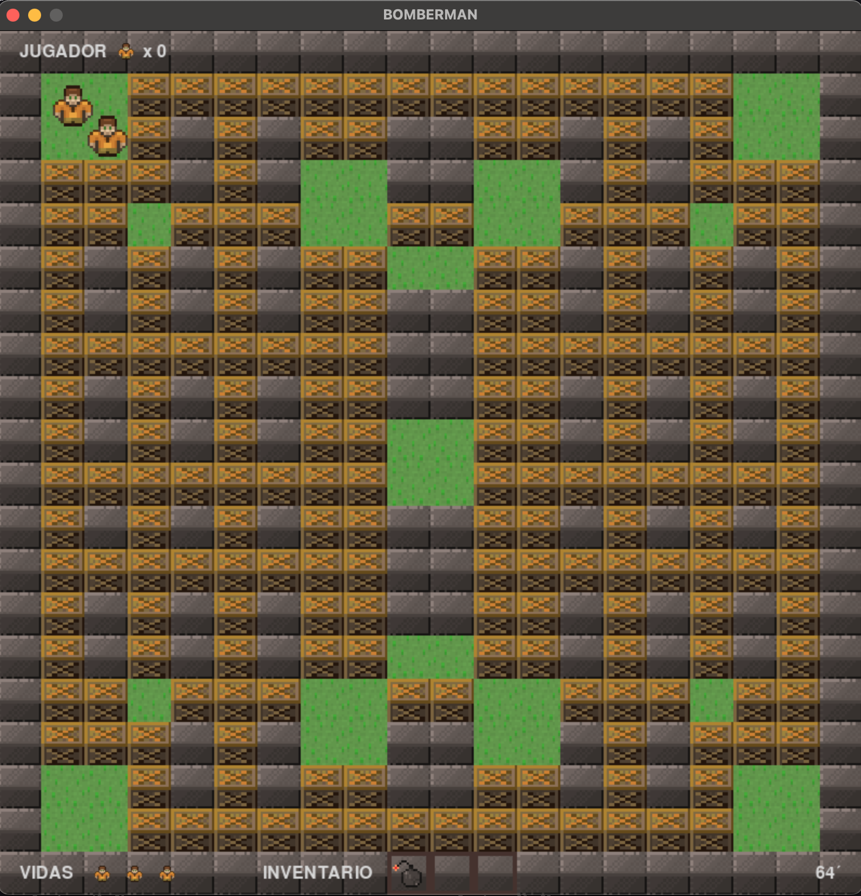

<p align="center">
    <a>
        
    </a>
</p>   


#### JUEGO “BATTLE ROYALE DE BOMBERMAN”
##### Battle Royale de Bomberman 


Juego en python y servidor en C. Que permite jugar hasta 4 jugadores en una misma partida. Donde el objetivo es ser el último jugador en pie.

Es un juego de acción, donde los jugadores se mueven en un laberinto y deben colocar bombas para destruir obstáculos y eliminar a los otros jugadores.




###### Instalaciones necesarias para ejecutar el juego

###### Manual del Juego

w,s,a,d: Movimiento del jugador
space: Colocar bomba

###### Reglas del Juego

Tres vidas por jugador.
El jugador que quede vivo gana.

###### Arquitectura General 
 
Desde el punto de Sistemas Operativos, el juego tiene una arquitectura cliente servidor, donde el servidor es un software multiproceso y multihebra con una gestión de recursos que le permita asegurar su coordinación y consistencia (procesos, hebras, memoria y archivos). Por el lado del cliente, este es un software gráfico donde se despliega el contenido del juego y permite capturar la interacción del usuario. 
 - A continuación, un esquema: 


 
##### Ejemplo de ejecución del juego: 

###### Servidor

En la carpeta server se encuentra el código del servidor.

Se compila con: gcc -pthread -o servidor server.c
Se ejecuta con: ./servidor [puerto]

###### Cliente

En la carpeta client se encuentra el código del cliente. Donde se pueden ejecutar hasta 4 instancias del cliente.

Se ejecuta con: python -m client.main

```bash

Read Client 1: {"player_position": [80, 79], "player_bombs_throwed": [], "player_direction": "down"}
Write Client 0: {"id": 1, "message": {"player_position": [80, 79], "player_bombs_throwed": [], "player_direction": "down"}}
Read Client 0: {"player_position": [48, 51], "player_bombs_throwed": [], "player_direction": "down"}
Write Client 1: {"id": 0, "message": {"player_position": [48, 51], "player_bombs_throwed": [], "player_direction": "down"}}
Read Client 1: {"player_position": [80, 79], "player_bombs_throwed": [], "player_direction": "down"}
Write Client 0: {"id": 1, "message": {"player_position": [80, 79], "player_bombs_throwed": [], "player_direction": "down"}}
Read Client 0: {"player_position": [48, 51], "player_bombs_throwed": [], "player_direction": "down"}
Write Client 1: {"id": 0, "message": {"player_position": [48, 51], "player_bombs_throwed": [], "player_direction": "down"}}
Read Client 1: {"player_position": [80, 79], "player_bombs_throwed": [], "player_direction": "down"}

```